# tMovies - Architecture Overview

## 1. Executive Summary

tMovies is a modern, responsive web application built with React 18 and TypeScript, designed to provide users with an intuitive movie and TV series discovery experience. The architecture follows current best practices for frontend applications, emphasizing performance, accessibility, and maintainability.

### 1.1 Key Architecture Decisions
- **Frontend-only Architecture**: Leverages external APIs with client-side state management
- **Static Site Deployment**: GitHub Pages hosting for simplicity and cost-effectiveness
- **Modern Tech Stack**: React 18, TypeScript, Vite for optimal developer experience
- **Performance-First**: Code splitting, lazy loading, and intelligent caching

## 2. System Overview

### 2.1 High-Level Architecture

```mermaid
graph TB
    User[👤 User] --> Browser[🌐 Browser]
    Browser --> App[⚛️ React App]
    App --> Cache[💾 RTK Query Cache]
    App --> Storage[🗄️ Local Storage]
    App --> API[🎬 TMDB API]
    
    subgraph "GitHub Pages"
        Static[📄 Static Files]
        Bundle[📦 JS Bundles]
        Assets[🖼️ Assets]
    end
    
    Browser --> Static
    Browser --> Bundle
    Browser --> Assets
```



### 2.2 Application Layers

| Layer | Technology | Purpose |
|-------|------------|---------|
| **Presentation** | React + TypeScript | UI components, user interactions |
| **State Management** | RTK Query + Context | Server state, global UI state |
| **Business Logic** | Custom Hooks + Utils | Application logic, data transformation |
| **Data Access** | RTK Query | API calls, caching, error handling |
| **External Services** | TMDB API | Movie/TV data, search, details |

## 3. Component Architecture

### 3.1 Component Hierarchy

```
App (Root)
├── Global Components
│   ├── VideoModal (Portal)
│   ├── SideBar (Navigation)
│   └── Header (Top Navigation)
├── Route Components
│   ├── Home
│   │   ├── Hero (Carousel)
│   │   └── Section × 4 (Content Lists)
│   ├── Catalog
│   │   ├── CatalogHeader (Filters)
│   │   ├── Search (Input + Results)
│   │   └── MovieCard Grid
│   ├── Detail
│   │   ├── Movie Info Section
│   │   ├── Cast & Crew
│   │   ├── Videos (Trailers)
│   │   └── Similar Content
│   ├── Watchlist
│   │   ├── Search (Internal)
│   │   └── Categorized Lists
│   └── NotFound (404)
└── Footer (Global)
```

### 3.2 Component Design Patterns

#### 3.2.1 Smart/Dumb Components
```typescript
// Smart Component (Container)
const Home = () => {
  const { data, isLoading, error } = useGetShowsQuery({
    category: "movie",
    type: "popular",
  });
  
  return <Hero movies={data?.results?.slice(0, 5)} />;
};

// Dumb Component (Presentational)
const Hero = ({ movies }: { movies: IMovie[] }) => {
  return (
    <Swiper>
      {movies.map(movie => <HeroSlide key={movie.id} movie={movie} />)}
    </Swiper>
  );
};
```

#### 3.2.2 Custom Hooks Pattern
```typescript
// Encapsulate complex logic
const useMotion = () => {
  const prefersReducedMotion = useMediaQuery("(prefers-reduced-motion: reduce)");
  const isMobile = useMediaQuery("(max-width: 768px)");
  
  return prefersReducedMotion || isMobile ? {} : animationVariants;
};

// Reusable business logic
const useWatchlist = () => {
  const context = useContext(WatchlistContext);
  if (!context) throw new Error("useWatchlist must be used within WatchlistProvider");
  return context;
};
```

## 4. State Management Architecture

### 4.1 State Categories & Solutions

```mermaid
graph LR
    subgraph "State Types"
        Server[🌐 Server State<br/>TMDB Data]
        Global[🌍 Global UI State<br/>Theme, Modals]
        Local[🏠 Local State<br/>Form Inputs]
        Persistent[💾 Persistent State<br/>Watchlist]
    end
    
    Server --> RTK[RTK Query]
    Global --> Context[React Context]
    Local --> UseState[useState Hook]
    Persistent --> LocalStorage[localStorage]
```



### 4.2 RTK Query Architecture

#### 4.2.1 API Service Design
```typescript
export const tmdbApi = createApi({
  reducerPath: "tmdbApi",
  baseQuery: fetchBaseQuery({ baseUrl: TMDB_API_BASE_URL }),
  endpoints: (builder) => ({
    // Flexible endpoint for multiple use cases
    getShows: builder.query({
      query: ({ category, type, page, searchQuery, showSimilarShows, id }) => {
        if (searchQuery) return `search/${category}?api_key=${API_KEY}&query=${searchQuery}&page=${page}`;
        if (showSimilarShows) return `${category}/${id}/similar?api_key=${API_KEY}`;
        return `${category}/${type}?api_key=${API_KEY}&page=${page}`;
      },
    }),
    getShow: builder.query({
      query: ({ category, id }) => 
        `${category}/${id}?append_to_response=videos,credits&api_key=${API_KEY}`,
    }),
  }),
});
```

#### 4.2.2 Cache Strategy
- **Automatic Caching**: RTK Query handles cache invalidation
- **Stale While Revalidate**: Serve cached data, fetch updates in background
- **Request Deduplication**: Multiple identical requests merged
- **Optimistic Updates**: UI updates before server confirmation

### 4.3 Context Architecture

```typescript
// Theme Context - System-wide UI preferences
interface ThemeContextValue {
  theme: 'light' | 'dark' | 'system';
  setTheme: (theme: ThemeType) => void;
  isDark: boolean;
}

// Global Context - Modal and video management
interface GlobalContextValue {
  videoKey: string;
  setVideoKey: (key: string) => void;
  showVideoModal: boolean;
  setShowVideoModal: (show: boolean) => void;
}

// Watchlist Context - User's saved content
interface WatchlistContextValue {
  watchlist: IWatchlistItem[];
  addItem: (item: IWatchlistItem) => void;
  removeItem: (id: string) => void;
  isInWatchlist: (id: string) => boolean;
  getWatchlistCount: () => number;
}
```

## 5. Data Flow Architecture

### 5.1 Request/Response Flow


### 5.2 Error Handling Flow

```typescript
// Component-level error handling
const Home = () => {
  const { data, isLoading, error } = useGetShowsQuery({
    category: "movie",
    type: "popular",
  });

  if (isLoading) return <Loader />;
  if (error) return <Error error="Unable to fetch movies!" />;
  
  return <MovieGrid movies={data.results} />;
};

// Global error boundary
class ErrorBoundary extends Component {
  componentDidCatch(error: Error, errorInfo: ErrorInfo) {
    console.error("Application Error:", error, errorInfo);
  }
  
  render() {
    if (this.state.hasError) {
      return <FallbackComponent />;
    }
    return this.props.children;
  }
}
```

## 6. Performance Architecture

### 6.1 Bundle Optimization Strategy

#### 6.1.1 Code Splitting
```typescript
// Route-based splitting
const Home = lazy(() => import("./pages/Home"));
const Catalog = lazy(() => import("./pages/Catalog"));
const Detail = lazy(() => import("./pages/Detail"));

// Component-based splitting for large components
const VideoModal = lazy(() => import("./components/VideoModal"));

// Suspense boundaries
<Suspense fallback={<Loader />}>
  <Routes>
    <Route path="/" element={<Home />} />
    <Route path="/:category" element={<Catalog />} />
  </Routes>
</Suspense>
```

#### 6.1.2 Asset Optimization
```typescript
// Image optimization with lazy loading
<LazyLoadImage
  src={`${TMDB_IMAGE_BASE_URL}/w500${movie.poster_path}`}
  alt={movie.title}
  effect="blur"
  wrapperClassName="movie-poster"
  placeholderSrc="/placeholder.jpg"
/>

// WebP support with fallbacks
<picture>
  <source srcSet={`${imageUrl}.webp`} type="image/webp" />
  <source srcSet={`${imageUrl}.jpg`} type="image/jpeg" />
  
</picture>
```

### 6.2 Runtime Performance

#### 6.2.1 React Optimizations
```typescript
// Memoization for expensive components
const MovieCard = React.memo(({ movie, category }) => {
  return <div>{/* Movie card content */}</div>;
});

// Callback memoization for event handlers
const handleSearch = useCallback(
  debounce((query: string) => {
    setSearchQuery(query);
  }, 300),
  []
);

// Ref forwarding for DOM access
const MovieCard = forwardRef<HTMLDivElement, MovieCardProps>(
  ({ movie, category }, ref) => {
    return <div ref={ref}>{/* Content */}</div>;
  }
);
```

#### 6.2.2 Animation Performance
```typescript
// GPU-accelerated animations
const slideVariants = {
  hidden: { 
    opacity: 0, 
    transform: "translateY(20px)",
    willChange: "transform, opacity"
  },
  visible: { 
    opacity: 1, 
    transform: "translateY(0px)",
    willChange: "auto"
  }
};

// Reduced motion compliance
const useMotion = () => {
  const prefersReducedMotion = useMediaQuery("(prefers-reduced-motion: reduce)");
  return prefersReducedMotion ? null : animationVariants;
};
```

## 7. Security Architecture

### 7.1 Client-Side Security

#### 7.1.1 XSS Prevention
```typescript
// React's built-in XSS protection
const MovieTitle = ({ title }: { title: string }) => {
  // Automatically escaped
  return <h1>{title}</h1>;
};

// Manual sanitization when needed
import DOMPurify from 'dompurify';

const SafeHTML = ({ html }: { html: string }) => {
  const sanitizedHTML = DOMPurify.sanitize(html);
  return <div dangerouslySetInnerHTML={{ __html: sanitizedHTML }} />;
};
```

#### 7.1.2 Data Validation
```typescript
// TypeScript interfaces for compile-time safety
interface IMovie {
  id: number;
  title: string;
  overview: string;
  poster_path: string | null;
  release_date: string;
  vote_average: number;
}

// Runtime validation for API responses
const validateMovie = (data: unknown): data is IMovie => {
  return (
    typeof data === 'object' &&
    data !== null &&
    'id' in data &&
    typeof (data as any).id === 'number'
  );
};
```

### 7.2 API Security

#### 7.2.1 Environment Variables
```typescript
// Safe client-side API key usage
const API_KEY = import.meta.env.VITE_API_KEY;
const TMDB_API_BASE_URL = import.meta.env.VITE_TMDB_API_BASE_URL;

// Note: TMDB API keys are read-only public keys
// Safe for client-side exposure
```

## 8. Accessibility Architecture

### 8.1 WCAG 2.1 Compliance Strategy

#### 8.1.1 Semantic HTML Structure
```typescript
const HomePage = () => {
  return (
    <main role="main" aria-label="Movie discovery homepage">
      <section aria-labelledby="hero-heading">
        <h1 id="hero-heading" className="sr-only">Featured Movies</h1>
        <Hero movies={featuredMovies} />
      </section>
      
      <section aria-labelledby="trending-heading">
        <h2 id="trending-heading">Trending Movies</h2>
        <MovieGrid movies={trendingMovies} />
      </section>
    </main>
  );
};
```

#### 8.1.2 Keyboard Navigation
```typescript
const MovieCard = ({ movie, category }: MovieCardProps) => {
  const handleKeyPress = (event: KeyboardEvent) => {
    if (event.key === 'Enter' || event.key === ' ') {
      navigate(`/${category}/${movie.id}`);
    }
  };

  return (
    <div
      role="button"
      tabIndex={0}
      onKeyPress={handleKeyPress}
      onClick={() => navigate(`/${category}/${movie.id}`)}
      aria-label={`View details for ${movie.title}`}
    >
      
      <h3>{movie.title}</h3>
    </div>
  );
};
```

#### 8.1.3 Screen Reader Support
```typescript
const WatchlistButton = ({ movie, isInWatchlist }: WatchlistButtonProps) => {
  return (
    <button
      onClick={toggleWatchlist}
      aria-label={`${isInWatchlist ? 'Remove' : 'Add'} ${movie.title} ${isInWatchlist ? 'from' : 'to'} watchlist`}
      aria-pressed={isInWatchlist}
    >
      <HeartIcon 
        filled={isInWatchlist} 
        aria-hidden="true" 
      />
      <span className="sr-only">
        {isInWatchlist ? 'Remove from watchlist' : 'Add to watchlist'}
      </span>
    </button>
  );
};
```

## 9. Testing Architecture

### 9.1 Testing Strategy

```mermaid
graph TB
    subgraph "Testing Pyramid"
        E2E[🎭 End-to-End Tests<br/>User Flows]
        Integration[🔗 Integration Tests<br/>API + Components]
        Unit[🧪 Unit Tests<br/>Components + Utils]
    end
    
    E2E --> Playwright[Playwright/Cypress]
    Integration --> RTL[React Testing Library]
    Unit --> Vitest[Vitest + RTL]
```



### 9.2 Test Implementation Examples

#### 9.2.1 Component Testing
```typescript
import { render, screen, fireEvent } from '@testing-library/react';
import { QueryClient, QueryClientProvider } from '@tanstack/react-query';
import { MovieCard } from './MovieCard';

const renderWithProviders = (component: ReactElement) => {
  const queryClient = new QueryClient({
    defaultOptions: { queries: { retry: false } },
  });
  
  return render(
    <QueryClientProvider client={queryClient}>
      {component}
    </QueryClientProvider>
  );
};

test('MovieCard displays movie information and handles click', () => {
  const mockMovie = {
    id: 1,
    title: 'Test Movie',
    poster_path: '/test.jpg',
    overview: 'Test overview',
  };

  renderWithProviders(
    <MovieCard movie={mockMovie} category="movie" />
  );

  expect(screen.getByText('Test Movie')).toBeInTheDocument();
  expect(screen.getByAltText('Test Movie poster')).toBeInTheDocument();
  
  fireEvent.click(screen.getByRole('button'));
  // Assert navigation or modal opening
});
```

#### 9.2.2 API Integration Testing
```typescript
import { rest } from 'msw';
import { setupServer } from 'msw/node';
import { renderHook, waitFor } from '@testing-library/react';
import { useGetShowsQuery } from '../services/TMDB';

const server = setupServer(
  rest.get(`${TMDB_API_BASE_URL}/movie/popular`, (req, res, ctx) => {
    return res(ctx.json({
      results: [
        { id: 1, title: 'Movie 1' },
        { id: 2, title: 'Movie 2' },
      ],
    }));
  })
);

test('useGetShowsQuery fetches and returns movie data', async () => {
  const { result } = renderHook(() => 
    useGetShowsQuery({ category: 'movie', type: 'popular' })
  );

  await waitFor(() => {
    expect(result.current.isSuccess).toBe(true);
  });

  expect(result.current.data.results).toHaveLength(2);
  expect(result.current.data.results[0].title).toBe('Movie 1');
});
```

## 10. Deployment Architecture

### 10.1 Build & Deployment Pipeline

```mermaid
graph LR
    Code[📝 Source Code] --> Build[🔨 Build Process]
    Build --> Bundle[📦 Production Bundle]
    Bundle --> Deploy[🚀 GitHub Pages]
    
    subgraph "Build Steps"
        TS[TypeScript Check]
        Bundle[Vite Build]
        Optimize[Asset Optimization]
    end
    
    subgraph "Deployment"
        Static[Static Files]
        CDN[GitHub CDN]
        Domain[Custom Domain]
    end
```



### 10.2 Production Configuration

#### 10.2.1 Vite Build Configuration
```typescript
// vite.config.ts
export default defineConfig({
  base: '/Movie-App/',
  plugins: [react(), eslint()],
  resolve: {
    alias: { "@": path.resolve(__dirname, "src") },
  },
  build: {
    target: 'es2015',
    minify: 'terser',
    rollupOptions: {
      output: {
        manualChunks: {
          vendor: ['react', 'react-dom'],
          api: ['@reduxjs/toolkit'],
          ui: ['framer-motion', 'react-icons'],
        },
      },
    },
  },
});
```

#### 10.2.2 Router Configuration
```typescript
// React Router with GitHub Pages support
<BrowserRouter basename="/Movie-App">
  <Routes>
    <Route path="/" element={<Home />} />
    <Route path="/watchlist" element={<Watchlist />} />
    <Route path="/:category/:id" element={<Detail />} />
    <Route path="/:category" element={<Catalog />} />
    <Route path="*" element={<NotFound />} />
  </Routes>
</BrowserRouter>
```

## 11. Monitoring & Analytics

### 11.1 Performance Monitoring

#### 11.1.1 Core Web Vitals Tracking
```typescript
// Web Vitals measurement
import { getCLS, getFID, getFCP, getLCP, getTTFB } from 'web-vitals';

const sendToAnalytics = ({ name, value, id }) => {
  gtag('event', name, {
    event_category: 'Web Vitals',
    event_label: id,
    value: Math.round(value),
    non_interaction: true,
  });
};

// Track all vitals
getCLS(sendToAnalytics);
getFID(sendToAnalytics);
getFCP(sendToAnalytics);
getLCP(sendToAnalytics);
getTTFB(sendToAnalytics);
```

#### 11.1.2 Custom Performance Metrics
```typescript
// API response time tracking
const trackAPIPerformance = (endpoint: string, startTime: number) => {
  const duration = Date.now() - startTime;
  
  gtag('event', 'api_response_time', {
    event_category: 'Performance',
    event_label: endpoint,
    value: duration,
  });
};

// Component render performance
const useRenderTime = (componentName: string) => {
  useEffect(() => {
    const startTime = performance.now();
    return () => {
      const renderTime = performance.now() - startTime;
      gtag('event', 'component_render_time', {
        event_category: 'Performance',
        event_label: componentName,
        value: Math.round(renderTime),
      });
    };
  }, [componentName]);
};
```

## 12. Future Architecture Considerations

### 12.1 Scalability Roadmap

#### 12.1.1 Short-term Enhancements (3-6 months)
- **Service Worker**: Offline capability and cache strategies
- **PWA Features**: App-like experience with install prompts
- **Database Layer**: User accounts with cloud sync
- **Advanced Search**: Full-text search with filters

#### 12.1.2 Medium-term Evolution (6-12 months)
- **Micro-frontends**: Modular architecture for team scaling
- **SSG/SSR**: Next.js migration for SEO and performance
- **Real-time Features**: WebSocket integration for live updates
- **ML Integration**: Personalized recommendations

#### 12.1.3 Long-term Vision (12+ months)
- **Multi-platform**: React Native mobile app
- **Internationalization**: Multi-language support
- **Advanced Analytics**: Custom analytics dashboard
- **Content Creation**: User-generated content features

### 12.2 Architecture Evolution Strategies

#### 12.2.1 Gradual Migration Approach
```typescript
// Example: Service Worker integration
// Phase 1: Add SW for static caching
if ('serviceWorker' in navigator) {
  navigator.serviceWorker.register('/sw.js');
}

// Phase 2: Add offline functionality
const useOfflineSupport = () => {
  const [isOnline, setIsOnline] = useState(navigator.onLine);
  
  useEffect(() => {
    const handleOnline = () => setIsOnline(true);
    const handleOffline = () => setIsOnline(false);
    
    window.addEventListener('online', handleOnline);
    window.addEventListener('offline', handleOffline);
    
    return () => {
      window.removeEventListener('online', handleOnline);
      window.removeEventListener('offline', handleOffline);
    };
  }, []);
  
  return isOnline;
};
```

#### 12.2.2 Backward Compatibility Strategy
- **Feature Flags**: Gradual rollout of new features
- **Fallback Components**: Graceful degradation for older browsers
- **Progressive Enhancement**: Core functionality first, enhancements second
- **API Versioning**: Support multiple TMDB API versions

## 13. Conclusion

The tMovies architecture demonstrates modern frontend development best practices, balancing performance, maintainability, and user experience. The modular design allows for incremental improvements while maintaining stability and reliability.

### Key Architectural Strengths:
- **Scalable Component Architecture**: Easy to extend and modify
- **Performance Optimized**: Code splitting, lazy loading, intelligent caching
- **Accessibility First**: WCAG 2.1 compliant with comprehensive a11y features
- **Developer Experience**: TypeScript, modern tooling, clear patterns
- **User Experience**: Responsive design, offline capabilities, smooth animations

This architecture provides a solid foundation for current requirements while maintaining flexibility for future enhancements and scaling needs.